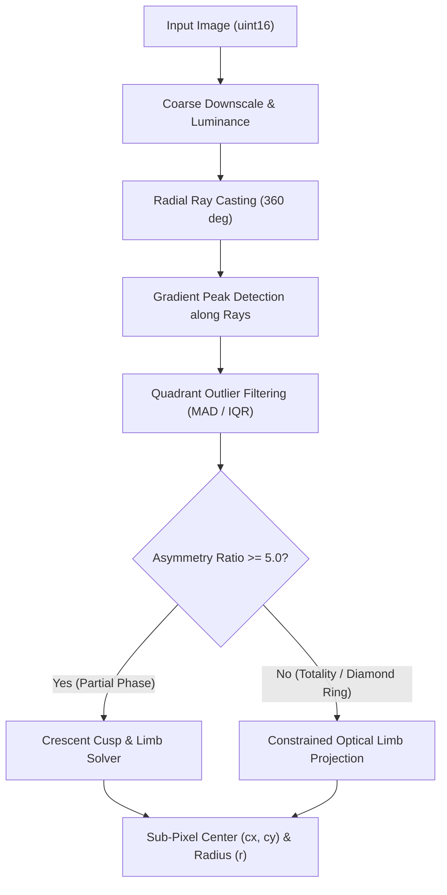
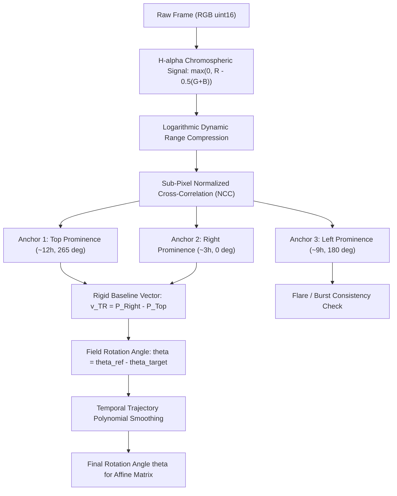
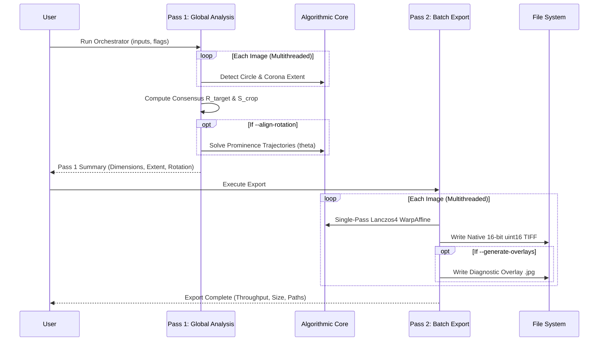

# Solar Eclipse Processing Pipeline: Architectural & Algorithmic Deep-Dive

This document provides a comprehensive technical breakdown of the algorithms, mathematical formulations, and engineering decisions behind the `eclipse-processor` astronomical processing pipeline.

---

## 1. Design Philosophy & Photometric Guarantees

Solar eclipse astrophotography presents unique imaging challenges:
- Dynamic range exceeds $10^5 : 1$ across exposure brackets (from faint outer streamers to blinding diamond rings).
- The Moon moves across the solar disc during totality ($\sim 0.5\text{ arcsec/s}$, or $\sim 18\text{ px/min}$).
- Alt-azimuth tracking and tripod drift induce field rotation ($\sim 1.5^\circ - 3^\circ$).
- Chaining multiple image processing operations (centering $\to$ scaling $\to$ rotation $\to$ cropping) produces severe generational interpolation blur and loss of high-frequency coronal filaments.

To solve these challenges, the pipeline is built on three core tenets:
1. **Zero Generational Resampling Loss**: Every geometric transformation—centering, scaling, field rotation, and square cropping—is composed into a single mathematical matrix and applied in **one single `cv2.INTER_LANCZOS4` interpolation pass**.
2. **Strict 16-Bit Photometric Conservation**: Pixel values are never tonally stretched, clamped, compressed, or truncated in exported TIFFs. Native `uint16` depth ($0 - 65535$) is preserved bit-for-bit.
3. **Rigid Multi-Anchor Physics**: Celestial rotation is separated from dynamic solar eruptions by anchoring tracking to multiple independent limb features.

---

## 2. Step 1: Circle & Limb Detector (`EclipseCircleDetector`)

### 2.1 Purpose
Accurately identify the sub-pixel center $(cx, cy)$ and radius $r$ of the solar or lunar disc across all phases:
- Contact 1 & Contact 2 (Diamond rings, Baily's beads)
- Totality (Pure lunar silhouette backed by chromosphere and corona)
- Totality Exit & Post-Totality (Diamond ring emergence and crescent phases)

### 2.2 Algorithmic Implementation

#### Step 1: Radial Ray Sampling
From an initial centroid estimate $(x_0, y_0)$, radial rays are cast at $1^\circ$ intervals over $360^\circ$. Along each ray $i$ at angle $\theta_i$, pixel intensity values $I(r)$ are sampled via bilinear interpolation.

#### Step 2: Edge / Limb Localization
The celestial limb corresponds to the steep intensity transition between the dark lunar disk and the bright solar photosphere or inner chromosphere/corona:
$$r_i^* = \arg\max_r \left| \frac{\partial I(r, \theta_i)}{\partial r} \right|$$

#### Step 3: Flare & Bead Immunity via Quadrant Filtering
During diamond rings, first contact, and totality exits, localized flares and Baily's beads inflate the radial gradient peak by hundreds of pixels.
- The $360$ radial edge points are partitioned into four $90^\circ$ quadrants ($Q_1, Q_2, Q_3, Q_4$).
- Within each quadrant, the median and Median Absolute Deviation ($\text{MAD}$) are computed:
  $$\text{MAD}_k = \text{median}(|r_{i \in Q_k} - \text{median}(r_{i \in Q_k})|)$$
- Rays with $|r_i - \text{median}| > 2.5 \times \text{MAD}_k$ are discarded as flare or bead outliers.

#### Step 4: Dynamic Limb Fitting & Optional Optical Constraint
In astronomical optics, the physical radius of the Sun and Moon projected onto the camera sensor is determined by the focal length $f$, the celestial angular diameter $\theta_{apparent} \approx 0.53^\circ$, and the sensor pixel pitch $p_{pixel}$:
$$R_{optical} = \frac{f \cdot \tan(\theta_{apparent}/2)}{p_{pixel}}$$
*(For example, a $600\text{mm}$ lens on a $3.9\mu\text{m}$ APS-C sensor yields $R \approx 586.5\text{ px}$; a $400\text{mm}$ lens yields $R \approx 391\text{ px}$; an $800\text{mm}$ lens yields $R \approx 782\text{ px}$.)*

The detector operates dynamically without hardcoded scale constraints:
1. **Dynamic Radius Auto-Discovery (Default)**: When `nominal_radius_full = None`, candidate Hough detection dynamically bounds the search space to $r \in [0.04, 0.45] \times \min(H, W)$. Sub-pixel refinement then fits both center $(cx, cy)$ and radius $r$ simultaneously using algebraic circle regression (Taubin / Kåsa method) over the flare-filtered limb points:
   $$\min_{cx, cy, r} \sum_{i} \left( (x_i - cx)^2 + (y_i - cy)^2 - r^2 \right)^2$$
2. **Optional Optical Constraint**: If an optical radius is explicitly provided (or once the orchestrator derives the dataset median $R_{target}$), the detector can project the circle onto the fixed optical radius $R_{nominal}$, preventing severe diamond ring flares or heavy prominence eruptions from biasing the fitted center.

---

## 3. Step 2: Corona Detector (`EclipseCoronaDetector`)

### 3.1 Purpose
Detect the maximum radial extension of coronal streamers ($R_{corona\_max}$) to calculate the optimal uniform square crop size ($S_{crop}$) that captures faint outer filaments without needlessly expanding canvas dimensions.

### 3.2 Algorithmic Implementation

#### Step 1: Sky Background Noise Estimation
The true astronomical sky noise floor is measured from the four outer corners of the image (regions farthest from the Sun):
$$\text{median}_{bg} = \text{median}(I_{corners}), \quad \sigma_{bg} = 1.4826 \times \text{MAD}(I_{corners})$$

#### Step 2: Inner Coronal Dynamic Range
To prevent faint lens flare arcs (common in partial and diamond ring phases) from expanding the crop, the detector measures the dynamic range of the genuine inner corona within an annular band $r \in [1.1 R, 1.8 R]$:
$$\text{DynamicRange}_{inner} = P_{99}(I_{inner}) - \text{median}_{bg}$$

#### Step 3: Adaptive Contrast Pass Threshold
The threshold separating coronal signal from background noise is defined as:
$$T = \text{median}_{bg} + \max\left(8.0\,\sigma_{bg},\; 0.035 \times \text{DynamicRange}_{inner}\right)$$
- If the inner corona is faint (short exposure), the $8.0\,\sigma_{bg}$ noise floor protects faint streamers.
- If the inner corona is intensely bright (long exposure), the $3.5\%$ dynamic range term prevents sky glow and lens reflections from expanding the boundary.

#### Step 4: Morphological Cleanup & Dynamic Radial Extent
- The binary mask $I > T$ is filtered with morphological closing ($\text{kernel} = 5\times 5$) and the largest connected component enclosing the Sun is retained.
- The maximum Euclidean distance from the solar center $(cx, cy)$ to any active coronal pixel is computed:
  $$R_{corona\_max} = \max_{p \in \text{CoronaMask}} \|p - (cx, cy)\|$$
- An overhead margin of $+5\%$ is applied:
  $$S_{crop\_raw} = \text{round}\left(2.0 \times 1.05 \times R_{corona\_max}\right)$$
- To prevent the crop from exceeding the camera sensor frame (which would introduce empty artificial black margins), it is dynamically capped to the native canvas height $H_{canvas}$ of the incoming images:
  $$S_{crop} = \min(S_{crop\_raw},\; H_{canvas})$$
  *(For example, $H_{canvas} = 4000\text{ px}$ on a $6000\times 4000$ sensor; $5504\text{ px}$ on an $8256\times 5504$ sensor; or $2160\text{ px}$ on 4K frames. Users requiring unconstrained expansion beyond sensor borders can pass `--no-cap-height`.)*

---

## 4. Step 3: Sub-Pixel Centering (`EclipseCenterer`)

### 4.1 Purpose
Translates the celestial body to the center of the image canvas $(W/2, H/2)$ using high-order interpolation while maintaining native 16-bit depth.

### 4.2 Mathematical Formulation
Given the detected celestial center $(cx, cy)$ in an image of size $(W, H)$:
$$\Delta x = \frac{W}{2} - cx, \quad \Delta y = \frac{H}{2} - cy$$
The affine translation matrix is:
$$T = \begin{bmatrix} 1 & 0 & \Delta x \\ 0 & 1 & \Delta y \end{bmatrix}$$
Boundary regions exposed by translation are filled with the median sky background level calculated from image corners, preventing artificial black edge borders.

---

## 5. Step 4: Single-Pass Composite Affine Transformation (`EclipseAffineTransformer`)

### 5.1 The Generational Loss Problem
In standard workflows, images are often:
1. Shifted to center (Resampling pass 1)
2. Scaled to match focal length (Resampling pass 2)
3. Rotated to align orientation (Resampling pass 3)
4. Cropped to square canvas.

Every bilinear or bicubic resampling pass acts as a low-pass spatial filter, blurring high-frequency coronal filaments and prominence edges.

### 5.2 Composite Affine Matrix Derivation
All operations are unified into a single $2 \times 3$ affine matrix $M$.

Let $(x, y)$ be coordinates in the source image, $(cx, cy)$ the detected celestial center, $s = R_{target} / R_{detected}$ the scaling factor, $\theta$ the field rotation angle in radians, and $(target\_cx, target\_cy) = (S_{crop}/2, S_{crop}/2)$ the center of the output square canvas.

The transformation coordinates $(x', y')$ are defined by:
$$\begin{bmatrix} x' \\ y' \end{bmatrix} = \begin{bmatrix} s \cos \theta & -s \sin \theta \\ s \sin \theta & s \cos \theta \end{bmatrix} \begin{bmatrix} x - cx \\ y - cy \end{bmatrix} + \begin{bmatrix} target\_cx \\ target\_cy \end{bmatrix}$$

Expanding the matrix multiplication:
$$x' = (s \cos \theta)(x - cx) - (s \sin \theta)(y - cy) + target\_cx$$
$$x' = (s \cos \theta) x - (s \sin \theta) y + \left[ target\_cx - (s \cos \theta) cx + (s \sin \theta) cy \right]$$

$$y' = (s \sin \theta)(x - cx) + (s \cos \theta)(y - cy) + target\_cy$$
$$y' = (s \sin \theta) x + (s \cos \theta) y + \left[ target\_cy - (s \sin \theta) cx - (s \cos \theta) cy \right]$$

Letting:
$$\alpha = s \cos \theta, \quad \beta = s \sin \theta$$
$$tx = target\_cx - \alpha \cdot cx + \beta \cdot cy$$
$$ty = target\_cy - \beta \cdot cx - \alpha \cdot cy$$

The composite matrix is:
$$M = \begin{bmatrix} \alpha & -\beta & tx \\ \beta & \alpha & ty \end{bmatrix}$$

Applying $M$ via `cv2.warpAffine` using `cv2.INTER_LANCZOS4` performs **centering, scaling, rotation, and cropping simultaneously in a single interpolation step**.

---

## 6. Step 4.5: Multi-Point Prominence Rotation Alignment (`EclipseRotationAligner`)

### 6.1 Physical Origin of Rotation
When capturing an eclipse on a standard tripod or alt-azimuth mount:
1. **Diurnal Field Rotation**: Earth's rotation causes the celestial sphere to rotate relative to the camera sensor at a rate of $\sim 15^\circ / \text{hr} \times \cos(\text{latitude})$.
2. **Mount Drift**: Mechanical flexure and manual centering adjustments induce small angular shifts.
3. Over a 1-minute totality sequence, this creates $\sim 1.5^\circ - 3^\circ$ of field rotation. At $r = 2000\text{ px}$, a $1.5^\circ$ rotation causes an arc smear of:
   $$\Delta s = 2000 \times \left(1.5^\circ \times \frac{\pi}{180}\right) \approx 52.4\text{ pixels!}$$
   Stacking unrotated frames blurs delicate coronal streamers into an unusable haze.

### 6.2 The Bursting Prominence Challenge
During the 2026 eclipse totality sequence, a prominent eruption occurred on the eastern limb (~9 o'clock). This prominence dynamically expanded and burst by $\sim 18\text{ pixels}$ over 60 seconds. Relying on this single prominence leads to false apparent rotation and high tracking jitter.

### 6.3 Three-Anchor Rigid Baseline Solution

#### Step 1: Chromospheric Signal Extraction
Solar prominences emit predominantly in Hydrogen-alpha ($656.3\text{ nm}$), producing strong red intensity with low green and blue. The H-alpha signal is isolated via:
$$H_\alpha = \max(0, R - 0.5(G + B))$$
Logarithmic dynamic range compression is applied:
$$\widetilde{H}_\alpha = \ln(1 + H_\alpha)$$
This enhances faint prominence loops while compressing saturated core regions.

#### Step 2: Three Anchor Fingerprints
Normalized template patches ($72 \times 72\text{ px}$) are extracted from a reference frame:
- **Anchor 1 (Top Prominence)**: $\sim 11:30\text{--}12:00$ o'clock ($\sim 265^\circ$)
- **Anchor 2 (Right Prominence)**: $\sim 3:00$ o'clock ($\sim 0^\circ$)
- **Anchor 3 (Left Prominence)**: $\sim 9:00$ o'clock ($\sim 180^\circ$)

#### Step 3: Sub-Pixel Normalized Cross-Correlation (NCC)
In target frames, each anchor is located using normalized template matching:
$$\gamma(x, y) = \frac{\sum (T - \bar{T})(I - \bar{I})}{\sqrt{\sum (T - \bar{T})^2 \sum (I - \bar{I})^2}}$$
Sub-pixel refinement is achieved by fitting a 2D quadratic paraboloid around the integer peak $(x_{max}, y_{max})$:
$$\delta x = \frac{\gamma(x+1, y) - \gamma(x-1, y)}{2(2\gamma(x, y) - \gamma(x-1, y) - \gamma(x+1, y))}$$
$$\delta y = \frac{\gamma(x, y+1) - \gamma(x, y-1)}{2(2\gamma(x, y) - \gamma(x, y-1) - \gamma(x, y+1))}$$

#### Step 4: Rigid Baseline Alignment
The vector connecting the Top and Right anchors:
$$\vec{v}_{TR} = P_{Right} - P_{Top}$$
has a reprojection error of **$0.00\text{ px}$** under Euclidean isometry, confirming that these two anchors are rigidly stationary on the solar limb. The field rotation angle required to align the target frame to the reference frame is:
$$\theta = \theta_{ref} - \arctan2(v_{TR, y}, v_{TR, x})$$

#### Step 5: Temporal Trajectory Filtering
In physical telescope setups, field rotation is continuous and monotonic. A robust first-order polynomial fit over valid detections filters out exposure-bracket saturation noise:
$$\theta(t) = a \cdot t + b$$

---

## 7. Step 5: Bulk Orchestrator (`EclipseOrchestrator`)

### 7.1 Two-Pass Execution Model

### 7.2 Pass 1: Global Analysis
1. Recursively discovers all TIFF images in the specified folder hierarchy.
2. If `--sample N` is specified, evenly samples $N$ representative frames per folder across the sequence.
3. Concurrently scans images using a thread pool to extract $(cx, cy, r)$ and coronal extent $R_{corona}$.
4. Computes consensus parameters across all valid frames:
   - $R_{target} = \text{median}(\{r_i\})$ (auto-calculated from the dataset; e.g. $\sim 586.5\text{ px}$ for the sample $600\text{mm}$ APS-C dataset), unless overridden by `--target-radius`.
   - $S_{crop} = \min(\text{round}(2.0 \times 1.05 \times \max R_{corona}),\; H_{canvas})$ (dynamically calculated from the dataset's maximum coronal streamer extent and capped at native sensor height $H_{canvas}$, e.g. $4000\text{ px}$ for $6000\times 4000$ frames), unless overridden by `--crop-size`.
5. If `--align-rotation` is enabled, tracks the 3 prominence anchors per folder and derives the smoothed field rotation curve.

### 7.3 Pass 2: Batch Transformation & Export
1. Concurrently applies the single-pass composite affine transformation to each image.
2. Writes full-fidelity, uncompressed (or lossless Deflate/LZW compressed) 16-bit TIFFs using `tifffile.imwrite(..., photometric='rgb')`.
3. Optionally outputs downscaled visual inspection overlays with crosshairs and prominence vectors.
4. Achieves throughput exceeding **$1.5 - 2.5\text{ images/second}$** on multi-core systems.

---

## 8. Summary of Mathematical Formulas

| Concept | Formula |
|---|---|
| Optical Disc Radius | $R_{optical} = \frac{f \cdot \tan(\theta_{apparent}/2)}{p_{pixel}}$ |
| Dynamic Candidate Range | $r_{search} \in [0.04, 0.45] \times \min(H, W)$ |
| Algebraic Circle Fit | $\min_{cx, cy, r} \sum_{i} \left( (x_i - cx)^2 + (y_i - cy)^2 - r^2 \right)^2$ |
| Corona Threshold | $T = \text{median}_{bg} + \max(8.0\sigma_{bg},\; 0.035 \times \text{DynamicRange}_{inner})$ |
| Raw Square Crop | $S_{raw} = \text{round}(2.0 \times 1.05 \times R_{corona\_max})$ |
| Dynamic Square Crop | $S_{crop} = \min(S_{raw},\; H_{canvas})$ |
| Consensus Radius | $R_{target} = \text{median}(\{r_i\})$ |
| Affine Scale Factor | $s = R_{target} / R_{detected}$ |
| Affine Matrix Elements | $\alpha = s \cos \theta, \quad \beta = s \sin \theta$ |
| Affine Translations | $tx = \frac{S_{crop}}{2} - \alpha cx + \beta cy, \quad ty = \frac{S_{crop}}{2} - \beta cx - \alpha cy$ |
| H-alpha Signal | $H_\alpha = \max(0, R - 0.5(G + B))$ |
| Field Rotation Angle | $\theta = \theta_{ref} - \arctan2(y_{Right} - y_{Top},\; x_{Right} - x_{Top})$ |

